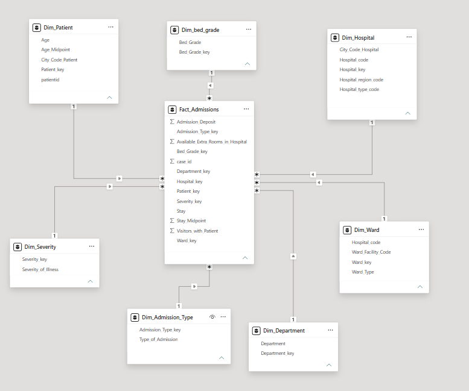
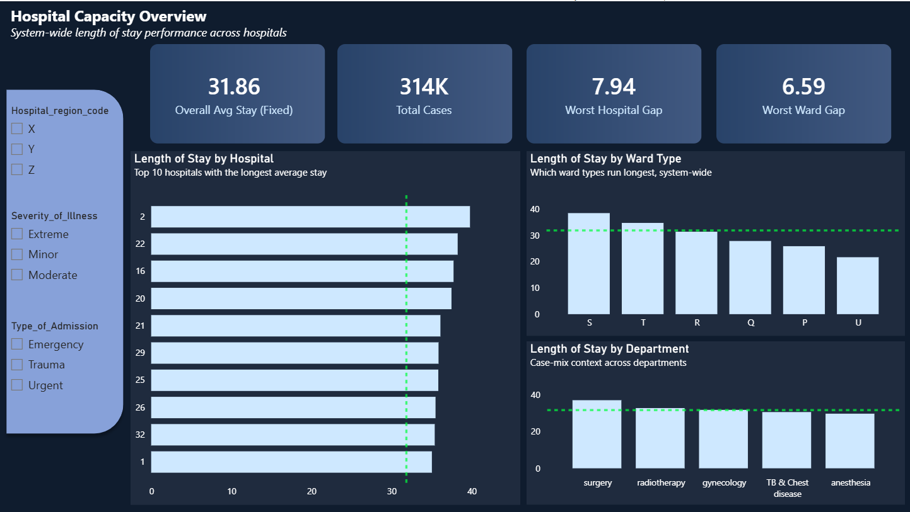

# Project Background

This project simulates a diagnostic analytics engagement for a multi-hospital operator whose Operations team flagged recurring ER congestion and suspected the root cause was insufficient ward capacity. As the data analyst on this engagement, the goal was to move the stakeholder from a vague symptom ("deliveries feel slow," in this case "wards feel full") to a specific, quantified, actionable root cause — following a structured discovery → diagnose → recommend process.

The dataset covers 318,438 patient admission records across 32 hospitals, 6 ward types, and 5 departments (source: [Kaggle — AV Healthcare Analytics II](https://www.kaggle.com/datasets/nehaprabhavalkar/av-healthcare-analytics-ii)). Per discovery scope, the engagement was intentionally limited to **operational capacity/throughput** (bed turnover, length of stay) and explicitly excluded cost/revenue analysis and readmission rate — both were either unconfirmed by Finance or owned by a separate team.

Insights and recommendations are provided on the following key areas:

- **Category 1: Hospital-Level Performance** — which hospitals run longest vs. system average, and by how much
- **Category 2: Ward & Department Case-Mix** — whether ward type or department explains the variation, and whether that variation is clinically justified
- **Category 3: Root-Cause Validation** — isolating the single worst-performing hospital-ward combination and ruling out patient severity as the cause
- **Category 4: Admission-Type Correction** — testing the stakeholder's original ER-congestion assumption against the data directly

The SQL queries used to inspect, clean, and model the data for this analysis can be found [here](01_cleaning_and_view.sql).

Targeted diagnostic SQL queries (hospital, ward, department, severity, admission-type breakdowns) can be found [here](02_diagnostic_queries.sql).

An interactive Power BI dashboard used to report and explore length-of-stay trends can be found [here](dashboard.pbix).

The full written case study (executive summary, methodology, and recommendation) is available [here](Hospital_LOS_Case_Study.docx).

 

# Data Structure & Initial Checks

The cleaned database structure consists of a star schema with one fact table and seven dimension tables, with a total of **313,793 admission records** in the fact table after cleaning (from an original 318,438 — a 1.5% reduction from removing rows with missing `Bed Grade` or `City_Code_Patient`). A description of each table is as follows:

- **Fact_Admissions:** grain = one row per patient case. Contains foreign keys to all seven dimensions plus measures: `Available_Extra_Rooms_in_Hospital`, `Visitors_with_Patient`, `Admission_Deposit`, `Stay` (label), `Stay_Midpoint` (numeric).
- **Dim_Hospital:** one row per hospital (32 rows) — `Hospital_code`, `Hospital_type_code`, `City_Code_Hospital`, `Hospital_region_code`.
- **Dim_Ward:** one row per hospital-ward combination (85 rows) — `Ward_Type`, `Ward_Facility_Code`, scoped by `Hospital_code`.
- **Dim_Department:** one row per department (5 rows) — Surgery, Radiotherapy, Gynecology, TB & Chest Disease, Anesthesia.
- **Dim_Patient:** one row per unique patient (90,344 rows) — `City_Code_Patient`, `Age`, `Age_Midpoint`.
- **Dim_Severity:** one row per severity tier (3 rows) — Extreme, Moderate, Minor.
- **Dim_Admission_Type:** one row per admission type (3 rows) — Trauma, Urgent, Emergency.
- **Dim_Bed_Grade:** one row per bed grade (4 rows).

Prior to modeling, a bucket-label corruption was identified and fixed: the range `"11-20"` had been auto-converted by a prior export process into the date-like string `"20-Nov"` in both the `Stay` and `Age` fields — a classic spreadsheet/Excel auto-formatting artifact that would have silently corrupted every record in that bucket if left unaddressed.

**Entity Relationship Diagram:**

 

# Executive Summary

### Overview of Findings

Average length of stay across the hospital system is 31.9 days, but this figure masks a sharp concentration problem: **Hospital 2's Ward S runs 10.3 days longer than the system average**, driven by roughly 4,300 cases per year. This is not explained by patient severity — the gap holds across Extreme, Moderate, *and* Minor cases — which rules out the "we just treat sicker patients" explanation and points to an operational cause. It also **corrects the stakeholder's original assumption**: the team believed ER (Emergency) congestion was the driver, but Trauma and Urgent admissions actually show the larger delays at this ward. Closing even half this gap would free approximately **22,100 bed-days per year** for new admissions, using capacity that Operations can act on directly without cross-hospital escalation.

 

# Insights Deep Dive
### Category 1: Hospital-Level Performance

* **System-wide average stay is 31.86 days**, serving as the fixed benchmark against which every hospital, ward, and department is compared throughout this analysis.

* **Hospital is the strongest lens for explaining variation.** Of the three dimensions tested (Hospital, Ward Type, Department), Hospital showed the widest spread — a 16-day gap between the best and worst performing hospitals — making it the primary axis for root-cause investigation.

* **Hospital 2 is the single worst-performing hospital**, running 7.94 days above the system average. The next several hospitals (22, 16, 20, 21…) cluster closely behind it, but Hospital 2 stands out as the clearest single outlier.

* **This ranking alone is not actionable** — knowing "Hospital 2 is worst" doesn't tell Operations *where inside* Hospital 2 to focus. This motivated the deeper ward-level and root-cause analysis in Categories 2 and 3.

  

### Category 2: Ward & Department Case-Mix

* **Ward Type shows a 13-day spread** (excluding Ward U, a 9-case outlier too small to be statistically meaningful). Ward S is the worst performer, running 6.59 days above the system average system-wide.

* **Department shows the weakest spread of the three lenses — only 8 days**, with Surgery highest (+6 vs. average) and Anesthesia lowest (-2 vs. average). This makes Department a useful supporting/context lens rather than a primary diagnostic driver.

* **Surgery's elevated average stay likely reflects legitimate case complexity, not inefficiency** — it has the lowest case volume of all departments (1,143 cases) alongside the highest average stay, a pattern consistent with clinically complex cases rather than an operational problem.

* **Combining Hospital 2 and Ward S produces a larger gap than either factor alone** — 10.27 days above system average, compared to 7.94 (Hospital 2 alone) or 6.59 (Ward S alone). This compounding effect is the strongest single signal in the dataset and became the focus of the root-cause investigation.

  

### Category 3: Root-Cause Validation — Hospital 2, Ward S

* **The gap is not explained by patient severity.** Comparing Ward S's average stay against the system-wide average *for the same severity tier* shows the gap holds at every level: Extreme (49 vs. 36 days, +13), Moderate (43 vs. 32, +11), and — most tellingly — Minor (35 vs. 28, +7). Minor-severity patients have no clinical reason to stay unusually long, which is strong evidence the cause is operational (discharge process, staffing, bed management) rather than clinical case-mix.

* **~4,300 cases per year pass through this specific hospital-ward combination**, giving the finding enough statistical weight to act on — this is not a small-sample artifact.

* **The gap translates to approximately 22,100 recoverable bed-days per year**, calculated conservatively at half the observed 10.27-day gap multiplied by annual case volume — capacity directly reusable for new admissions if closed.

### Category 4: Admission-Type Correction

* **The original stakeholder framing pointed to ER congestion as the driver** — the Operations team's opening complaint was specifically about Emergency-department backups. The data does not support Emergency admissions as the primary cause.

* **Trauma admissions show the largest gap at Ward S** — 45 days vs. a system-wide Trauma benchmark of 34 days (+11), the single largest admission-type gap observed.

* **Urgent admissions show an even larger relative gap** — 43 vs. 30 days (+13), the widest gap of any admission type tested.

* **Emergency admissions, while still elevated, show the smallest gap of the three** — 37 vs. 30 days (+7) — meaning the visible symptom (ER congestion) is real, but the underlying driver is more closely tied to how Trauma and Urgent cases are managed *after* admission, not to ER intake volume itself. Surfacing this distinction is arguably the most valuable output of this analysis, since it redirects the fix toward the actual lever rather than the assumed one.

 

# Recommendations:

Based on the insights and findings above, we would recommend the Hospital 2 Operations/Ward Management team to consider the following:

* Ward S at Hospital 2 runs 10.27 days above system average across ~4,300 annual cases, and this gap persists across every severity tier. **Audit discharge timing and staffing for Ward S by end of next quarter**, prioritizing the discharge process itself (physician sign-off timing, transport coordination, family/step-down bed availability) over patient-mix explanations, since case-mix has been ruled out.

* Trauma and Urgent admissions — not Emergency — drive the largest delays at Ward S. **Redirect the operational fix toward Trauma/Urgent case handling** rather than ER intake capacity, which was the team's original assumption.

* Ward Q, in the same hospital, performs close to system average. **Use Ward Q's staffing ratios and shift coverage as an internal best-practice benchmark** for Ward S, since it eliminates most confounding variables (same hospital, same overall resourcing environment).

* The 22,100 bed-days/year opportunity is a conservative, half-gap estimate that falls entirely within Operations' existing authority (staffing, bed/ward reallocation, discharge process) — **no cross-hospital or regional escalation is required to act on this finding**, which should accelerate implementation.

* **Re-run this analysis 90 days after any intervention** to confirm the gap has meaningfully narrowed before considering any broader, cross-hospital rebalancing effort.

 

# Assumptions and Caveats:

Throughout the analysis, multiple assumptions were made to manage challenges with the data and its scope. These assumptions and caveats are noted below:

* The `Stay` and `Age` fields were provided as ranges (e.g., "11-20"), not exact values. Both were converted to numeric midpoints (e.g., 15) to allow averaging — this introduces a small, unavoidable estimation error in every average reported.

* The open-ended "More than 100 Days" `Stay` bucket has no defined upper bound. It was conservatively capped at 100 for midpoint calculations and should be read as a **minimum estimate** — true values in this bucket are likely higher.

* Rows with missing `Bed Grade` (113 rows) or `City_Code_Patient` (4,532 rows) were removed rather than imputed — a combined 1.5% of records — since both fields were low-volume enough that deletion carried negligible statistical risk, and imputation risked introducing bias into an ordinal (Bed Grade) or non-central (City_Code_Patient) field.

* `Admission_Deposit` could not be confirmed by the (simulated) client as representing true cost or revenue — it may be a partial estimate, fixed intake fee, or something else entirely. It was **intentionally excluded from any financial claims** in this analysis and used only as a secondary field, per discovery scope.

* This dataset is an anonymized competition extract ([Kaggle / Analytics Vidhya](https://www.kaggle.com/datasets/nehaprabhavalkar/av-healthcare-analytics-ii)), not a live hospital data feed. It contains no admission/discharge dates, so **trend-over-time and seasonality could not be analyzed** — all findings reflect a single aggregated snapshot.

* Readmission rate was explicitly out of scope per discovery (owned by a separate stakeholder team), so no claims are made about whether shorter stays at Ward S would risk increased readmissions — this would be a natural check before implementing any discharge-timing changes in practice.
